<p align="center">
  
</p>

<h1 align="center">RevenueTwin</h1>
<h3 align="center">Autonomous Revenue Recovery Digital Twin · Powered by Multi-Agent AI</h3>

<p align="center">
  
  
  
  
  
  
  
  
</p>

<p align="center">
  <b>10 specialist AI agents</b> autonomously detect, decide, execute, and learn from revenue recovery actions across payments, carts, subscriptions, B2B receivables, and more — with <b>real Razorpay API integration</b>, <b>LLM-powered reasoning</b>, and <b>full observability</b>.
</p>

---

## Table of Contents

- [The Problem](#-the-problem)
- [What RevenueTwin Does](#-what-revenuetwin-does)
- [System Architecture](#-system-architecture)
- [The 10 Specialist Agents](#-the-10-specialist-agents)
- [Decision Pipeline Deep Dive](#-decision-pipeline-deep-dive)
- [The Agentic Recovery Loop](#-the-agentic-recovery-loop)
- [LLM Integration & Resilience](#-llm-integration--resilience)
- [Razorpay API Integration](#-razorpay-api-integration)
- [Data Model](#-data-model)
- [Self-Calibrating Policy System](#-self-calibrating-policy-system)
- [Frontend Observatory](#-frontend-observatory)
- [API Reference](#-api-reference)
- [Test Suite](#-test-suite)
- [Tech Stack](#-tech-stack)
- [Getting Started](#-getting-started)
- [Project Structure](#-project-structure)

---

## 🚨 The Problem

Every payment platform silently bleeds revenue. Failed payments, abandoned carts, churning subscriptions, aging receivables — these are **recoverable** losses that go unrecovered because existing solutions are rule-based, reactive, and one-size-fits-all.

```
┌──────────────────────────────────────────────────────────────────────────────────┐
│                     THE SILENT REVENUE HEMORRHAGE                                │
├──────────────────────────────────┬───────────────┬───────────────────────────────┤
│  Revenue Leak Type               │  Industry Loss │  Current "Solution"          │
├──────────────────────────────────┼───────────────┼───────────────────────────────┤
│  Payment Failures (soft decline) │   5-10%       │  Dumb retry at fixed intervals│
│  Cart Abandonment                │   ~70%        │  Generic email blast          │
│  Checkout Dropoff                │   25-40%      │  ❌ Nothing                   │
│  Subscription Churn              │   5-7%/month  │  Manual outreach              │
│  B2B Receivables Aging           │   30-60 day   │  Collections calls            │
│  Mandate / Autopay Failures      │   3-8%        │  ❌ Nothing                   │
│  Payment Degradation (systemic)  │   Varies      │  ❌ Manual monitoring          │
└──────────────────────────────────┴───────────────┴───────────────────────────────┘
```

**The core issue:** These are fundamentally *different* problems that require *different* expertise, *different* data, and *different* actions. A one-size-fits-all retry engine can't handle them.

---

## 🧠 What RevenueTwin Does

RevenueTwin is a **Digital Twin** of a merchant's entire revenue pipeline. It deploys **10 domain-specialist AI agents**, each with isolated context, isolated actions, and isolated policies, to autonomously recover revenue across every leak type.

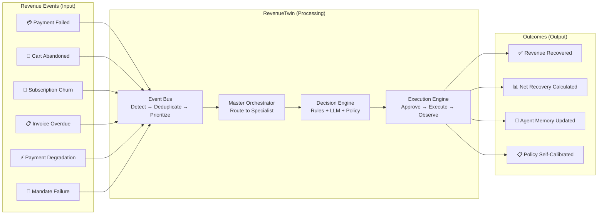

### The Closed-Loop Promise

Unlike traditional dunning systems that stop at "retry and pray," RevenueTwin closes the entire loop:

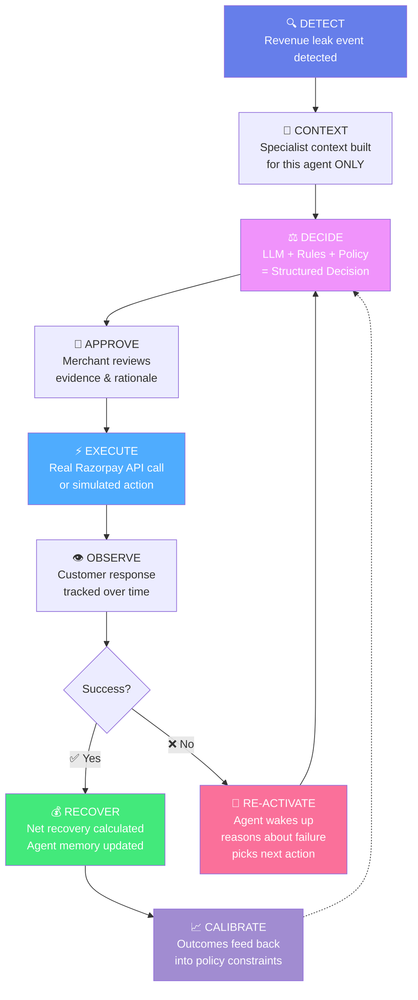

---

## 🏗️ System Architecture

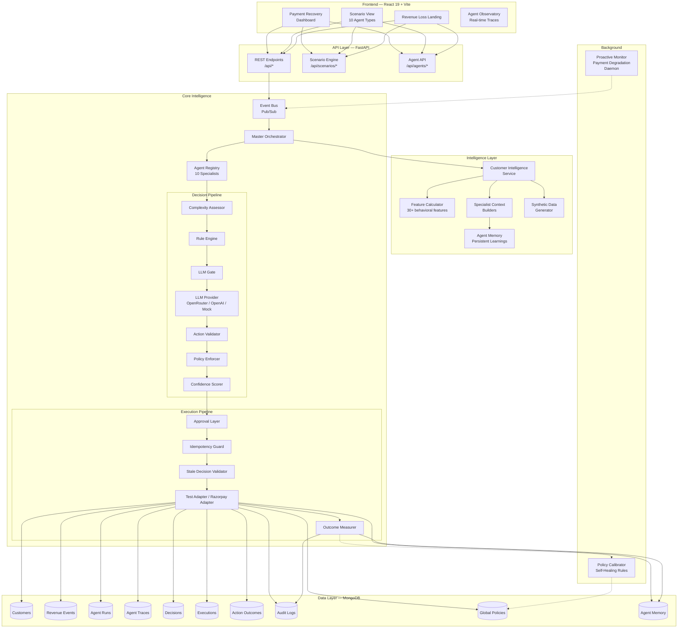

---

## 🤖 The 10 Specialist Agents

Each agent has its own **decision profile**, **context builder**, **system prompt**, **allowed actions**, and **hard constraints**. No two agents share the same data, prompt, or action set.

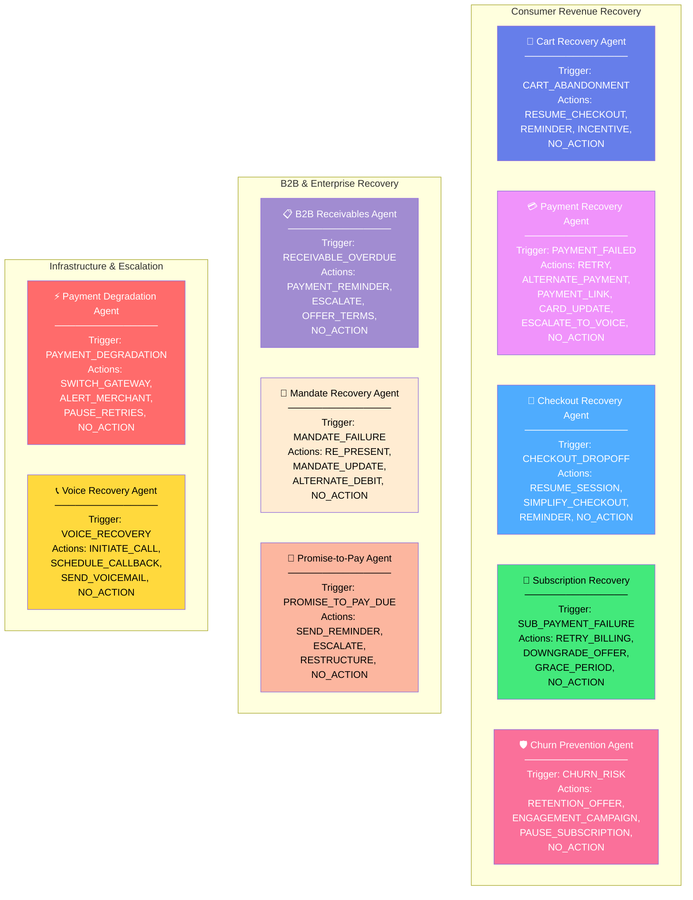

### Agent Context Isolation (No "Prompt Bleed")

This is the critical architectural guarantee: **each agent sees ONLY its own data**.

```
┌─────────────────────────────────────────────────────────────────────────────┐
│                        CONTEXT ISOLATION MATRIX                             │
├──────────────────────┬────────┬──────┬───────┬──────┬────────┬─────────────┤
│  Data Field          │  Cart  │ Pay  │  Sub  │  B2B │Mandate │  Voice      │
├──────────────────────┼────────┼──────┼───────┼──────┼────────┼─────────────┤
│  cart_history         │   ✅   │  ❌  │  ❌   │  ❌  │   ❌   │    ❌       │
│  product_affinity     │   ✅   │  ❌  │  ❌   │  ❌  │   ❌   │    ❌       │
│  payment_history      │   ❌   │  ✅  │  ❌   │  ❌  │   ❌   │    ✅       │
│  issuer_signals       │   ❌   │  ✅  │  ❌   │  ❌  │   ❌   │    ❌       │
│  subscription_tenure  │   ❌   │  ❌  │  ✅   │  ❌  │   ❌   │    ❌       │
│  plan_details         │   ❌   │  ❌  │  ✅   │  ❌  │   ❌   │    ❌       │
│  invoice_history      │   ❌   │  ❌  │  ❌   │  ✅  │   ❌   │    ❌       │
│  payment_terms        │   ❌   │  ❌  │  ❌   │  ✅  │   ❌   │    ❌       │
│  mandate_schedule     │   ❌   │  ❌  │  ❌   │  ❌  │   ✅   │    ❌       │
│  call_history         │   ❌   │  ❌  │  ❌   │  ❌  │   ❌   │    ✅       │
│  notification_fatigue │   ✅   │  ✅  │  ✅   │  ✅  │   ✅   │    ✅       │
└──────────────────────┴────────┴──────┴───────┴──────┴────────┴─────────────┘
```

---

## ⚙️ Decision Pipeline Deep Dive

Every revenue event flows through a rigorous, fully observable 12-stage pipeline:

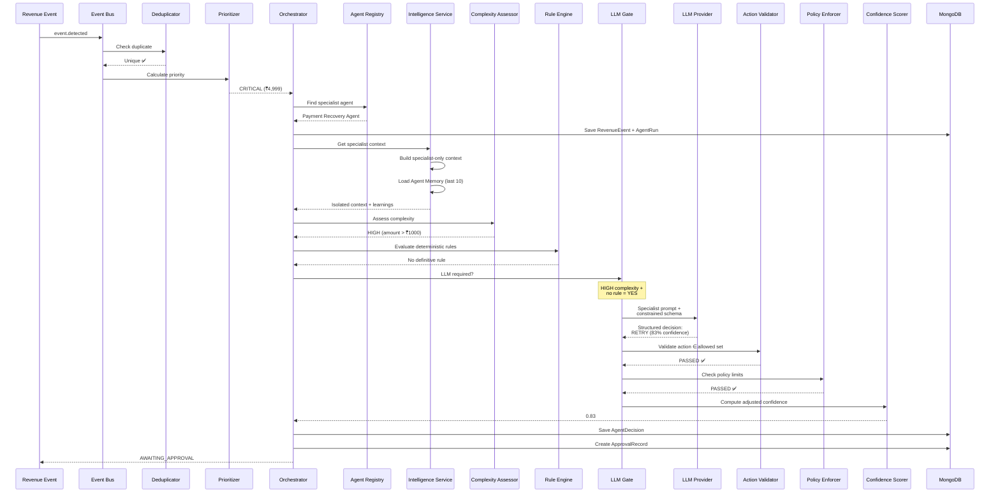

### The LLM Gate — When Intelligence Is Actually Needed

Not every event needs an LLM call. The complexity gate minimizes cost and latency:

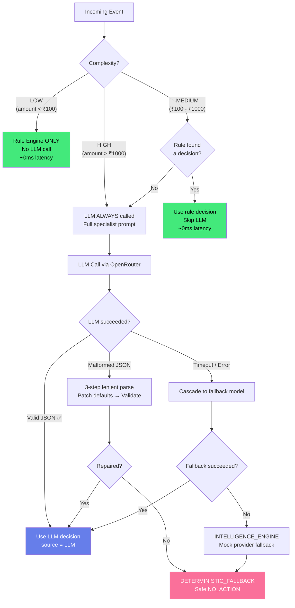

---

## 🔄 The Agentic Recovery Loop

This is what makes RevenueTwin fundamentally different from a retry engine. Agents don't just fire-and-forget — they **observe, reason, and adapt**:

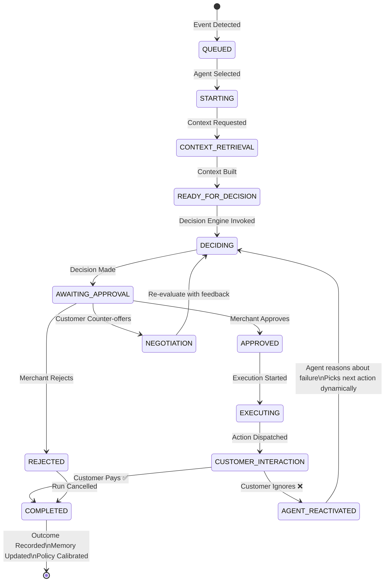

### Dynamic Multi-Step Recovery Example

```
┌──────────────────────────────────────────────────────────────────────────────┐
│                    PAYMENT RECOVERY — DYNAMIC LOOP                          │
│                                                                              │
│  Step 1: Agent decides → RETRY (83% confidence)                             │
│          Rationale: "Soft decline from issuer. Retry window open 2h."       │
│          ↓                                                                   │
│          Customer Response: ❌ PAYMENT_FAILED (retry also declined)          │
│                                                                              │
│  Step 2: Agent REACTIVATES → evaluates failure                              │
│          Reasoning: "Card retry failed. Issuer soft-decline persisted.      │
│           Switching to alternate payment rails (UPI/NetBanking)."           │
│          Agent decides → ALTERNATE_PAYMENT (86% confidence)                 │
│          ↓                                                                   │
│          Customer Response: ❌ IGNORED (checkout abandoned)                  │
│                                                                              │
│  Step 3: Agent REACTIVATES → evaluates failure                              │
│          Reasoning: "Interactive checkout timed out. Customer may not be    │
│           ready. Switching to async Razorpay Payment Link (24h valid)."     │
│          Agent decides → PAYMENT_LINK (82% confidence)                      │
│          ⚡ Razorpay API called → Real payment link generated               │
│          ↓                                                                   │
│          Customer Response: ✅ PURCHASED via payment link!                   │
│                                                                              │
│  Outcome: ₹4,999 RECOVERED | Net: ₹4,998.50 | 3 steps, fully autonomous   │
│  Memory: "RETRY failed for this customer. ALTERNATE_PAYMENT abandoned.      │
│           PAYMENT_LINK succeeded — prefer async for this customer."          │
└──────────────────────────────────────────────────────────────────────────────┘
```

---

## 🧩 LLM Integration & Resilience

### Provider Architecture

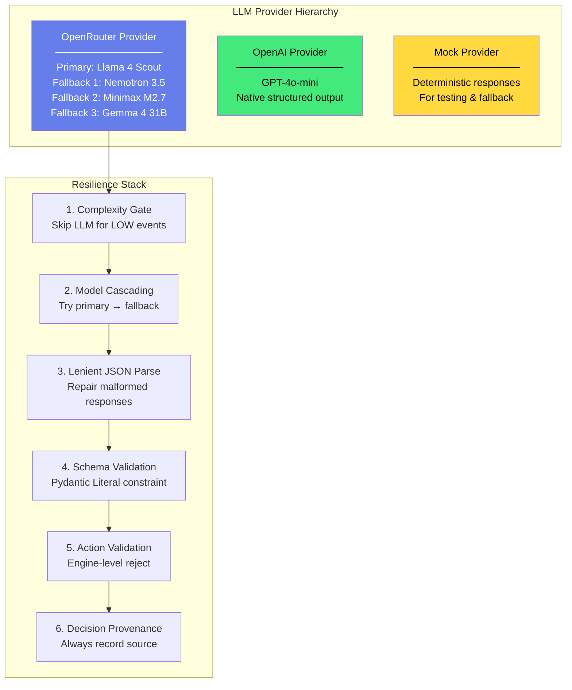

### Structured Decision Output

Every LLM decision is constrained to this schema (invalid actions are rejected at the Pydantic level):

```json
{
  "decision": "RETRY",
  "confidence": 0.83,
  "thought_process": [
    "Failure analysis: soft decline from bank, not a hard block. RETRY is safe.",
    "Historical data: customer has 90% success rate on this payment method.",
    "Fatigue check: zero recent recovery contacts — customer is receptive.",
    "Recovery plan: RETRY → ALTERNATE_PAYMENT → PAYMENT_LINK."
  ],
  "evidence": [
    { "signal": "TRANSIENT_FAILURE", "importance": "HIGH", "description": "Temporary bank decline — not a permanent block." },
    { "signal": "HIGH_PAYMENT_HISTORY", "importance": "HIGH", "description": "9 of 10 payments succeeded." },
    { "signal": "SOFT_DECLINE_SIGNAL", "importance": "HIGH", "description": "Retry window open for 2 hours." },
    { "signal": "LOW_CONTACT_FATIGUE", "importance": "MEDIUM", "description": "No recent recovery attempts." }
  ],
  "rationale": "Soft bank decline with strong history. Immediate retry is highest-probability.",
  "observation_window_hours": 2,
  "requires_approval": true,
  "reason_codes": ["TRANSIENT_FAILURE", "HIGH_SUCCESS_RATE", "SOFT_DECLINE"],
  "rejected_actions": [
    { "action": "NO_ACTION", "reason": "83% recovery probability — inaction loses this payment." },
    { "action": "CARD_UPDATE", "reason": "Card not blocked — update not warranted for soft decline." }
  ],
  "risk_flags": ["RETRY_WINDOW_EXPIRES_IN_2H"]
}
```

---

## 💳 Razorpay API Integration

RevenueTwin doesn't just recommend — it **executes**. When the Payment Recovery Agent decides `PAYMENT_LINK`, the system generates a **real Razorpay Payment Link**:

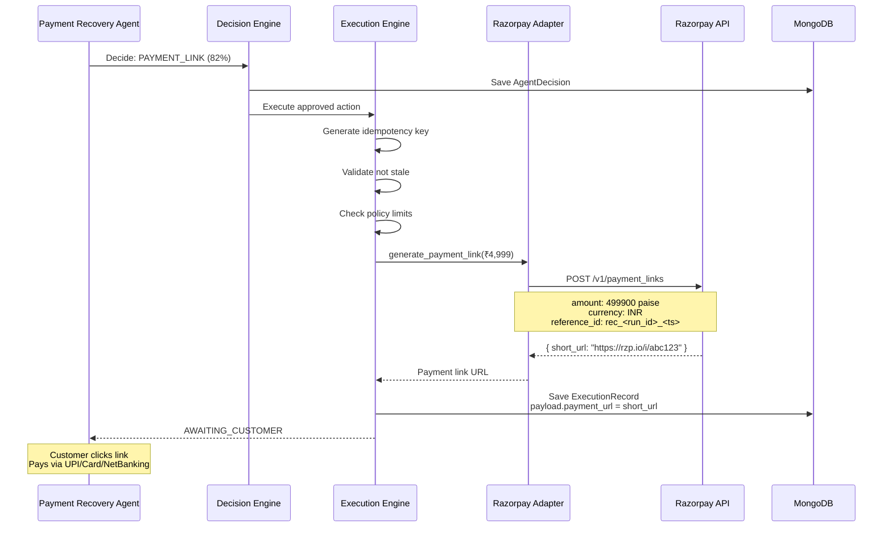

---

## 📊 Data Model

RevenueTwin uses **28 MongoDB collections** managed via Beanie ODM with full async support:

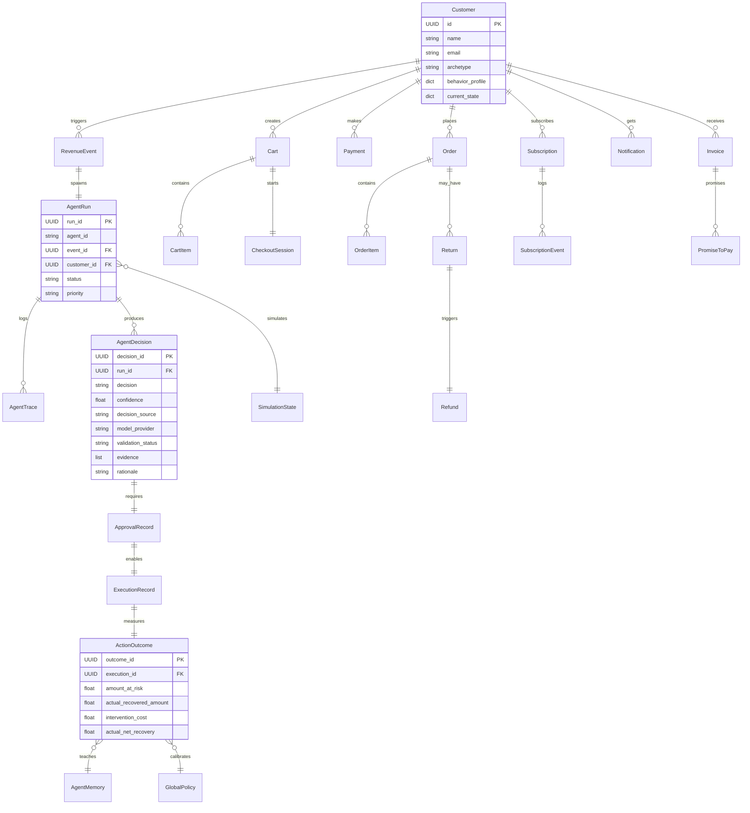

### Behavioral Feature Engineering

The Intelligence Layer computes **30+ behavioral features** from raw data:

```
┌───────────────────────────────────────────────────────────────────────┐
│                    FEATURE CALCULATOR OUTPUT                          │
├─────────────────────────┬─────────────────────────┬──────────────────┤
│  Order Features          │  Payment Features        │  Risk Signals   │
├─────────────────────────┼─────────────────────────┼──────────────────┤
│  purchase_frequency      │  payment_success_rate    │  churn_risk     │
│  orders_last_30d         │  payment_failure_rate    │  payment_       │
│  orders_last_90d         │  method_success_rate     │   reliability   │
│  average_order_value     │  retry_success_rate      │  notification_  │
│  median_order_value      │                          │   fatigue       │
│  purchase_recency_days   │                          │                 │
│  gross_revenue           │                          │                 │
│  net_revenue             │                          │                 │
│  customer_lifetime_value │                          │                 │
├─────────────────────────┼─────────────────────────┼──────────────────┤
│  Cart Features           │  Notification Features   │  B2B Features   │
├─────────────────────────┼─────────────────────────┼──────────────────┤
│  cart_abandonment_rate   │  response_rate           │  avg_invoice_   │
│  checkout_completion_    │  ignore_rate             │   delay_days    │
│   rate                   │  notification_fatigue    │  overdue_rate   │
│  checkout_abandonment_   │                          │  promise_to_pay │
│   rate                   │                          │   success_rate  │
│  return_rate             │                          │  promise_break_ │
│  refund_rate             │                          │   rate          │
└─────────────────────────┴─────────────────────────┴──────────────────┘
```

---

## 🔁 Self-Calibrating Policy System

The system **learns from its own outcomes** and automatically adjusts agent constraints:

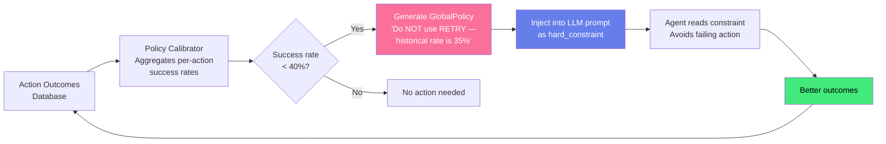

---

## 🖥️ Frontend Observatory

The frontend provides a **real-time agent observatory** — watching agents think, decide, and act:

### Three Main Views

| View | Purpose | Size |
|------|---------|------|
| **Revenue Loss Landing** | Select from 10 agent scenario types, generate synthetic data, launch live scenarios | ~40KB |
| **Scenario View** | Universal view for all 10 agent types — traces, evidence, approval, execution | ~57KB |
| **Payment Recovery Dashboard** | Dedicated agentic loop dashboard with multi-step recovery visualization | ~98KB |

### What You See in Real-Time

```
┌──────────────────────────────────────────────────────────────────────────────┐
│  🤖 Payment Recovery Agent — Live Scenario                                  │
├──────────────────────────────────────────────────────────────────────────────┤
│                                                                              │
│  ┌─ TRACE LOG (live streaming) ──────────────────────────────────────────┐   │
│  │  [14:32:01] EVENT      PAYMENT_FAILED detected                       │   │
│  │  [14:32:01] ROUTING    Payment Recovery Agent selected                │   │
│  │  [14:32:02] CONTEXT    Specialist context built                       │   │
│  │  [14:32:02] EVIDENCE   TRANSIENT_FAILURE: Soft decline (HIGH)        │   │
│  │  [14:32:03] EVIDENCE   HIGH_PAYMENT_HISTORY: 9/10 success (HIGH)     │   │
│  │  [14:32:03] EVIDENCE   LOW_CONTACT_FATIGUE: No recent contact (MED)  │   │
│  │  [14:32:04] COMPLEXITY HIGH                                           │   │
│  │  [14:32:04] LLM GATE   Called — scenario complexity is HIGH           │   │
│  │  [14:32:05] LLM CALL   Calling Llama 4 Scout via OpenRouter...       │   │
│  │  [14:32:06] REASONING  Analyzing transaction history & issuer signals │   │
│  │  [14:32:07] LLM RESULT RETRY (83% confidence)                        │   │
│  │  [14:32:07] POLICY     PASSED ✅                                      │   │
│  │  [14:32:08] DECISION   RETRY [source=LLM]                            │   │
│  │  [14:32:08] STATUS     AWAITING_APPROVAL                             │   │
│  └───────────────────────────────────────────────────────────────────────┘   │
│                                                                              │
│  ┌─ EVIDENCE CARDS ──────────────────────────────────────────────────────┐   │
│  │  🔴 HIGH  TRANSIENT_FAILURE     Temporary bank decline               │   │
│  │  🔴 HIGH  HIGH_PAYMENT_HISTORY  9 of 10 payments succeeded           │   │
│  │  🔴 HIGH  SOFT_DECLINE_SIGNAL   Retry window open 2 hours            │   │
│  │  🟡 MED   LOW_CONTACT_FATIGUE   No recent recovery contacts          │   │
│  └───────────────────────────────────────────────────────────────────────┘   │
│                                                                              │
│  ┌─ ACTION ──────────────────────────────────────────────────────────────┐   │
│  │  Recommended: RETRY (83% confidence)                                  │   │
│  │  Rationale: "Soft bank decline with strong payment history."          │   │
│  │                                                                       │   │
│  │  [ ✅ APPROVE ]  [ ❌ REJECT ]  [ 💬 NEGOTIATE ]                     │   │
│  └───────────────────────────────────────────────────────────────────────┘   │
│                                                                              │
└──────────────────────────────────────────────────────────────────────────────┘
```

---

## 📡 API Reference

### Core Endpoints

| Method | Endpoint | Purpose |
|--------|----------|---------|
| `GET` | `/api/agents` | List all 10 specialist agents with status |
| `GET` | `/api/agents/{id}` | Agent details, allowed actions, data access |
| `POST` | `/api/agents/{id}/decide` | Trigger a decision for a specific agent |
| `POST` | `/api/events` | Submit a revenue event |
| `GET` | `/api/agent-runs/{id}/traces` | Stream agent reasoning traces |
| `GET` | `/api/agent-runs/{id}/decision` | Get the structured decision |
| `POST` | `/api/agent-runs/{id}/approve` | Merchant approves action |
| `POST` | `/api/agent-runs/{id}/reject` | Merchant rejects action |
| `POST` | `/api/agent-runs/{id}/execute` | Execute the approved action |
| `POST` | `/api/agent-runs/{id}/resolve` | Record customer response |
| `POST` | `/api/agent-runs/{id}/negotiate` | Customer counter-offer loop |
| `GET` | `/api/agent-runs/{id}/timeline` | Full lifecycle timeline |
| `GET` | `/api/llm/health` | LLM provider health check |
| `POST` | `/api/policies/calibrate` | Trigger policy self-calibration |

### Scenario System

| Method | Endpoint | Purpose |
|--------|----------|---------|
| `POST` | `/api/scenarios/generate-synthetic` | Generate synthetic customer + context |
| `POST` | `/api/scenarios/start` | Launch a live agent scenario |
| `GET` | `/api/scenarios/{id}/context` | Get specialist context for scenario |
| `GET` | `/api/scenarios/{id}/evidence` | Get evidence cards |
| `GET` | `/api/scenarios/{id}/data-access` | Audit data access |

---

## ✅ Test Suite

13 tests covering the **12 Step-6 requirements** plus a bonus specialist uniqueness test:

```
┌────┬─────────────────────────────────────────────────────────┬──────────┐
│  # │  Test                                                    │  Status  │
├────┼─────────────────────────────────────────────────────────┼──────────┤
│  1 │  Cart agent receives ONLY cart context                   │    ✅    │
│  2 │  B2B agent receives ONLY B2B context                     │    ✅    │
│  3 │  Subscription agent receives ONLY subscription context   │    ✅    │
│  4 │  LLM returns valid action from allowed set               │    ✅    │
│  5 │  Invalid action is schema-rejected (Pydantic Literal)    │    ✅    │
│  6 │  Invalid JSON is handled (fail-closed, never execute)    │    ✅    │
│  7 │  LLM timeout is handled gracefully                       │    ✅    │
│  8 │  LLM unavailable → DETERMINISTIC_FALLBACK                │    ✅    │
│  9 │  Missing context doesn't crash prompt builder            │    ✅    │
│ 10 │  Every decision has all required metadata fields          │    ✅    │
│ 11 │  No API key / secret exposed in any response             │    ✅    │
│ 12 │  No production payment execution occurs                  │    ✅    │
│ 13 │  All 10 specialist prompts are unique and distinct        │    ✅    │
└────┴─────────────────────────────────────────────────────────┴──────────┘
```

Run tests:
```bash
cd backend
python -m pytest tests/ -v
```

---

## 🛠️ Tech Stack

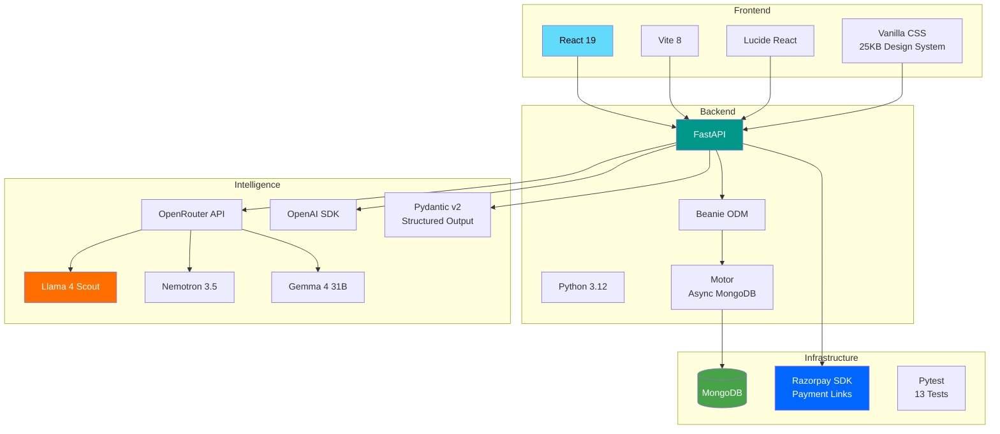

---

## 🚀 Getting Started

### Prerequisites

- Python 3.12+
- Node.js 18+
- MongoDB (local or Atlas)
- OpenRouter API key (free tier works)
- Razorpay test API keys (optional)

### Backend Setup

```bash
cd RevenueTwin/backend

# Create virtual environment
python -m venv venv
source venv/bin/activate  # Windows: venv\Scripts\activate

# Install dependencies
pip install fastapi uvicorn motor beanie pydantic python-dotenv openai razorpay

# Configure environment
cp .env.example .env
# Edit .env with your keys:
#   OPENROUTER_API_KEY=your_key
#   MONGODB_URI=mongodb://localhost:27017
#   RZP_TEST_KEY=your_razorpay_test_key (optional)

# Run the server
uvicorn app.main:app --reload --port 8000
```

### Frontend Setup

```bash
cd RevenueTwin/frontend

# Install dependencies
npm install

# Start dev server
npm run dev
```

### Run Tests

```bash
cd RevenueTwin/backend
python -m pytest tests/ -v
```

---

## 📁 Project Structure

```
RevenueTwin/
├── backend/
│   ├── app/
│   │   ├── main.py                          # FastAPI app + lifespan
│   │   ├── config.py                        # Settings
│   │   │
│   │   ├── agents/                          # 🤖 10 Specialist Agents
│   │   │   ├── base.py                      # BaseAgent + AgentDecisionProfile
│   │   │   ├── registry.py                  # Agent Registry (singleton)
│   │   │   ├── orchestrator.py              # Master Revenue Orchestrator
│   │   │   ├── payment_recovery/agent.py    # Payment Recovery Agent
│   │   │   ├── cart_recovery/agent.py       # Cart Recovery Agent
│   │   │   ├── checkout_recovery/agent.py   # Checkout Recovery Agent
│   │   │   ├── subscription_recovery/       # Subscription Recovery Agent
│   │   │   ├── churn_prevention/            # Churn Prevention Agent
│   │   │   ├── receivables/                 # B2B Receivables Agent
│   │   │   ├── mandate_recovery/            # Mandate Recovery Agent
│   │   │   ├── promise_to_pay/              # Promise-to-Pay Agent
│   │   │   ├── payment_degradation/         # Payment Degradation Agent
│   │   │   └── voice_recovery/              # Voice Recovery Agent
│   │   │
│   │   ├── decisions/                       # ⚖️ Decision Engine
│   │   │   ├── engine.py                    # Core pipeline (510 lines)
│   │   │   ├── complexity.py                # Complexity assessor
│   │   │   ├── rules.py                     # Rule evaluator
│   │   │   ├── policy.py                    # Policy enforcer
│   │   │   └── validators.py                # Confidence evaluator
│   │   │
│   │   ├── execution/                       # ⚡ Execution Engine
│   │   │   ├── engine.py                    # Approve → Execute → Observe (298 lines)
│   │   │   ├── idempotency.py               # Idempotency key generator
│   │   │   ├── validators.py                # Stale decision + policy checks
│   │   │   └── adapters/
│   │   │       ├── test_adapter.py          # Simulated executor
│   │   │       └── razorpay_adapter.py      # Real Razorpay Payment Links
│   │   │
│   │   ├── intelligence/                    # 🧠 Customer Intelligence
│   │   │   ├── service.py                   # Intelligence service
│   │   │   ├── features.py                  # 30+ behavioral features
│   │   │   ├── schemas.py                   # Context & feature schemas
│   │   │   └── specialist/
│   │   │       ├── contexts.py              # Per-agent context builders
│   │   │       └── synthetic.py             # Synthetic data generator
│   │   │
│   │   ├── llm/                             # 🤖 LLM Layer
│   │   │   ├── provider.py                  # OpenRouter + OpenAI providers
│   │   │   ├── mock.py                      # Mock provider for testing
│   │   │   ├── context_builder.py           # Specialist prompt assembler
│   │   │   ├── schemas.py                   # DecisionOutput + dynamic schema
│   │   │   └── prompts/                     # 10 specialist prompt modules
│   │   │       ├── cart_recovery.py
│   │   │       ├── payment_recovery.py
│   │   │       ├── b2b_receivables.py
│   │   │       └── ... (10 total)
│   │   │
│   │   ├── events/                          # 📡 Event System
│   │   │   ├── event_bus.py                 # Pub/Sub event bus
│   │   │   ├── event_store.py               # Deduplicator + prioritizer
│   │   │   ├── event_engine.py              # Event processing
│   │   │   └── event_types.py               # Canonical event types
│   │   │
│   │   ├── simulation/                      # 🎮 Simulation Engine
│   │   │   ├── engine.py                    # Virtual clock + time advancement
│   │   │   ├── customer_behavior.py         # Deterministic behavior model
│   │   │   └── monitor.py                   # Proactive anomaly detection
│   │   │
│   │   ├── policies/                        # 📋 Self-Calibrating Policies
│   │   │   └── calibrator.py                # Outcome → constraint generator
│   │   │
│   │   ├── models/
│   │   │   └── domain.py                    # 28 MongoDB document models
│   │   │
│   │   ├── api/                             # 🌐 API Routes
│   │   │   ├── endpoints.py                 # Core REST endpoints
│   │   │   ├── agents.py                    # Agent descriptions
│   │   │   ├── scenarios.py                 # Scenario management
│   │   │   ├── simulation.py                # Simulation endpoints
│   │   │   └── demo.py                      # Demo helpers
│   │   │
│   │   └── db/
│   │       └── connection.py                # MongoDB + Beanie init
│   │
│   ├── tests/                               # 🧪 Test Suite
│   │   ├── test_llm_integration.py          # 13 Step-6 tests
│   │   ├── test_agents.py                   # Agent registry tests
│   │   ├── test_intelligence.py             # Intelligence tests
│   │   └── test_health.py                   # Health check tests
│   │
│   └── docs/                                # 📚 Internal Documentation
│       ├── decision-engine.md
│       ├── execution-engine.md
│       ├── customer-intelligence.md
│       ├── data-model.md
│       ├── event-engine.md
│       └── feature-definitions.md
│
└── frontend/
    ├── src/
    │   ├── App.jsx                          # Router (3 views)
    │   ├── index.css                        # 25KB design system
    │   ├── pages/
    │   │   ├── RevenueLossLanding.jsx        # Agent selection (~40KB)
    │   │   ├── ScenarioView.jsx              # Universal scenario view (~57KB)
    │   │   └── PaymentRecoveryDashboard.jsx  # Agentic loop dashboard (~98KB)
    │   ├── components/
    │   │   ├── AgentDetailPanel.jsx           # Agent detail view (~76KB)
    │   │   ├── AgentSidebar.jsx               # Sidebar navigation (~18KB)
    │   │   └── observatory/
    │   │       ├── CustomerJourney.jsx        # Journey visualization
    │   │       └── JourneyNode.jsx            # Journey node component
    │   └── hooks/
    │       └── useScenarioPolling.js          # Real-time trace polling
    ├── package.json
    └── vite.config.js
```

---

<p align="center">
  <b>Built with ❤️ for the Razorpay Buildathon</b>
  <br/>
  <sub>10 Agents · 28 Collections · 30+ Features · 13 Tests · 1 Mission: Recover Every Rupee</sub>
</p>
